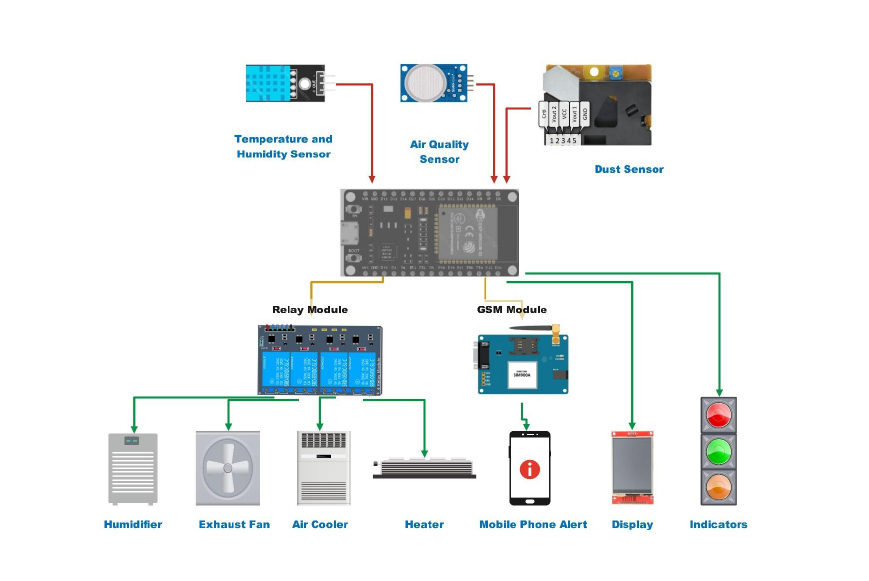
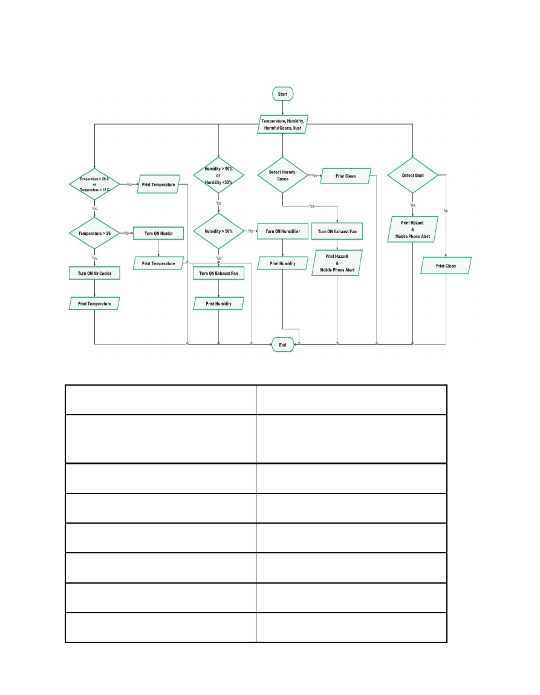

[]{#3} ``{=html}

::: {#page3-div style="position:relative;width:892px;height:1262px;"}
**1) Background **

** **

**1.1 Overview of Automated Air Quality Monitoring System **

Automated Air Quality Monitoring System is to make the air away from our home in a suitable 

condition  for  human  beings  to  live  in.  For  example,  removing  harmful  air  from  our  air, 

removing dust. It is also possible to control humidity and temperature. 

 

**1.2) Automation\'s Necessity **

** **

With the help of this system, the user can always breathe pure Air. Because of the cleanliness 

of the air, respiratory diseases are also reduced. As we can control
this system through an app, 

we can monitor our air
quality, humidity, temperature and other Atmospheric conditions in the 

area which is covered by the system. All these facilities save time and reduce human workloads. 

And also this system has higher efficiency
because of the higher accuracy of sensor readings. 

 

 

**2) Problem and Motivation **

** **

**2.1) Main Problem is Maintaining Air Quality **

** **

Modern living environments are increasingly plagued by poor Indoor air quality, which can 

significantly impact human health and well-being. 

The problem  of poor-quality  indoor air is  becoming  prevalent in  modern-day homes  and is 

detrimental to human health. Solutions available today for maintaining a comfortable indoor 

environment  are,  as  a  rule,  quite  inefficient,  time-consuming,  and  lack  responsiveness  to 

changing external conditions. 

In order to overcome these difficulties, we offer to create an Arduino-based home automation 

system that creates, tracks, and manages a range of the following
environmental parameters. 

•

 

**Temperature:**

 Temperature  extremes  act  upon  man  giving  rise  to  sicknesses. Their 

ambient influence strengthens predisposition to any respiratory
infection. 

•

 

**Humidity:**

 High Humidity: Too much moisture then develops molds and mildews; such 

airborne material contains allergenic agents and spores in the air.  

 
:::

[]{#4} ``{=html}

::: {#page4-div style="position:relative;width:892px;height:1262px;"}
•

 

**Low Humidity:**

 An absence of sufficient humidity may dry out the mucus membranes 

leaving them irritated and raw. 

•

 

**Harmful  gases:**

  With  indoor  air  pollution  contributing  to  it  In-house  cooking  and 

cleaning  and  various  other  household  consumer  products  vent  out  dangerous  gases, 

carbon monoxide or nitrogen dioxide, and many other volatile organic
compounds. 

•

 

**Dust:**

 Overabundance of Dust particles prey on indoor air when, instead of ventilation 

and  air  conditioning,  such  places  lack  regular  cleaning.  Consequently,  breathing 

problems, allergies, and other associated health complications. 

 

**2.2) Motivation **

** **

**Protect Public Health: **

•

 

Decrease lung & respiratory diseases, like asthma but also bronchitis
and cancer.   

•

 

Low cardiovascular diseases and stroke.  

•

 

Provide Relief from Allergies and Skin Irritations.  

•

 

Enhanced cognitive function and well-being. 

 

**Improve the Quality of Environment:  **

•

 

Helping to slow climate change by lowering greenhouse gas emissions. 

•

 

Ecosystem and Biodiversity influences protection. 

•

 

Increase visibility and protect infrastructure from damage due to air
pollution. 

**Boost Economic Productivity: **

•

 

Air pollution-related illnesses lead to high healthcare costs. 

•

 

Improve indoor air quality to enhance worker productivity. 

•

 

Clean the air and attract businesses that will invest in clean areas. 

•

 

To improve tourism and recreational offerings. 

•

 

The aim of this is to achieve sustainable development. 

•

 

Make cities and human settlements inclusive, safe, resilient and
sustainable. 

•

 

Encourage environmentally friendly culture. 

•

 

Formulate creative solutions that address the problems linked to air
quality.  

 

 
:::

[]{#5} ``{=html}

::: {#page5-div style="position:relative;width:892px;height:1262px;"}
These motivations are drivers which suggest that projects to improve air quality can also make 

a  positive  contribution  towards  the  creation  of  healthier,  more  sustainable  and  prosperous 

societies for all. 

 

 

**3) Aim and Objectives **

** **

**3.1) Aim **

The aim of this project is to build an automated air quality maintenance system that actively 

evaluates  and  updates  indoor  environmental  factors  to  create  a  safe,  comfortable,  and 

environmentally friendly living space. This Arduino-based system will regulate temperature 

and humidity as well as reduce pollutants including dust, volatile organic compounds, and other 

harmful  gases. By monitoring air quality  in  real  time and reacting immediately, the system 

promises  to  reduce  health  risks,  increase  comfort  in  the  home,  and  improve  a  healthy 

environment

**. **

** **

**3.2) Objectives **

•

 

**Air Quality Monitoring: **

The project will consist of the development and introduction 

of sensors that accurately measure important indoor pollutants such as
volatile organic 

acids (VOCs), particle matter (PM), and harmful gases including carbon monoxide and 

nitrogen dioxide. These sensors will provide continuing, real-time data on air quality 

levels in the home, enable the system to monitor changes and detect harmful pollutants 

as they happen. By ensuring precision and security in recognizing a variety of indoor 

air pollutants, the monitoring system lays a solid system for responsive control of air 

quality. 

•

 

**Humidity  and  Temperature  Control: **

The  project  will  use  creative  methods  to 

guarantee  monitored  humidity  as  well  as  proper  temperatures,  both  of  which  are 

essential  to  developing  a  healthy  indoor  environment.  The  system,  using  humidity 

machines to reduce water content, humidifiers to add it when the room becomes too 

dried. and programmable thermostats for controlling temperature will help reduce mold 

formation,  breathing  problems  discomfort,  and  other  illnesses  consistent  with  bad 

indoor  climate  control.  By  allowing  automated  changes  of  important  environmental 

factors, the system provides a comfortable and healthy home
environment.  

 
:::

[]{#6} ``{=html}

::: {#page6-div style="position:relative;width:892px;height:1262px;"}
•

 

**Sustainability Measures: **

Sustainability will be an important factor when creating the 

system,  with  features that  reduce energy usage  and reduce the need for  artificial air 

fresheners or other chemical-based air quality solutions. Energy-efficient components 

will be included in order that they only activate when needed, reducing
energy use and 

the system\'s total environmental impact. The project improves cleaner indoor air and 

reduces greenhouse gas emissions, which benefits personal health and the environment. 

•

 

**Health  and  Economic  Benefits: **

Ensure  that  the  system\'s  abilities  improve  the 

community\'s  health  by  reducing  respiratory  diseases  and  improving  cognitive  well-

being, so improving output and reducing healthcare costs. 

 

 

**4) System Diagram **

{width="892" height="600"
style="position:absolute;top:480px;left:80px;"}

** **

** **

** **

** **

** **

 
:::

[]{#7} ``{=html}

::: {#page7-div style="position:relative;width:892px;height:1262px;"}
{style="position: absolute; top: 0px;"}

**5) Methodology **

**5.1) Item and Description **

**Item **

**Description **

DHT11 

Temperature and Humidity Sensor 

Module 

MQ135 

Air Quality Sensor Module 

DSM501A 

Dust Sensor Module 

ESP32 

Microcontroller 

4 Ch Relay Module 

**- **

TFT Display 

**- **

SIM900A 

GSM Module 

** **

** **

 
:::

[]{#8} ``{=html}

::: {#page8-div style="position:relative;width:892px;height:1262px;"}
**5.2) System Design and Hardware Integration **

Through this system, the following conditions will be controlled. 

**Temperature:**

 The DHT11 sensor reads the temperature of selected area, and the reading 

will be processed by the microcontroller. If the temperature is greater than or less than 

the limits, the Air Cooler or the Heater turns on respectively.  

 

**Humidity:**

 Humidity is also read by the DHT11 sensor. After getting the reading of the 

sensor, the microcontroller will process data. If the relative humidity is greater than 50%, 

the exhaust
fan will turn on. If the relative humidity is less than 30%, the humidifier will 

turn on. 

**Harmful gases:**

 Harmful gases such as Ammonia, Sulfide, and Benzene-based vapors 

and Smoke will be monitored through this system using MQ135 sensor, and it provides 

a  solution  for  these  harmful  gases.  If  the  system  detects  such  gas,  the  air  inside  the 

controlled  area  will  be  drawn  out  completely  and  refilled  and  the  Central  Unit  of  the 

system will emit a Hazard Sound until the completion of the process. 

**Dust:**

  The  dust  inside  controlled  area  is  detected  by  DSM501A  sensor.  If  the  sensor 

detects dust particles, the Central  Unit  of the system  will emit a Sound and a Mobile 

Phone Alert. This section is designed as a user
controllable division.   

 

**6) Evaluation Method **

•

 

**Data  Collection:**

  Regularly  collect  data  using  appropriate  sensors  for  each 

parameter. 

•

 

**Analysis:**

  Compare  collected  data  against  established  health  and  comfort 

standards. 

•

 

**Continuous  Monitoring:**

  Implement  a  system  for  continuous  monitoring  to 

ensure that air quality remains within acceptable limits. Smart air quality monitors 

can provide real-time data and alerts. 

•

 

**Conclusion:**

 A  comprehensive  evaluation  of  air  quality  considering  humidity, 

temperature, dust, and harmful gases is crucial for maintaining a healthy indoor 

 
:::

[]{#9} ``{=html}

::: {#page9-div style="position:relative;width:892px;height:1262px;"}
environment.  Regular  monitoring  and  timely  interventions  can  significantly 

improve air quality and occupant well-being. 

 

**References **

[*https://aq.nbro.gov.lk/*](https://aq.nbro.gov.lk/)

[* *](https://aq.nbro.gov.lk/)

[*https://www.cea.lk/web/images/pdf/airqulity/AQI-*](https://www.cea.lk/web/images/pdf/airqulity/AQI-SL_Calculation_Guideline_CEA.LK_V1.0.pdf)

[*SL_Calculation_Guideline_CEA.LK_V1.0.pdf*](https://www.cea.lk/web/images/pdf/airqulity/AQI-SL_Calculation_Guideline_CEA.LK_V1.0.pdf)

[* *](https://www.cea.lk/web/images/pdf/airqulity/AQI-SL_Calculation_Guideline_CEA.LK_V1.0.pdf)

[*https://www.researchgate.net/search?q=indoor%20air%20quality*](https://www.researchgate.net/search?q=indoor%20air%20quality)

[* *](https://www.researchgate.net/search?q=indoor%20air%20quality)

[*https://arduino-tutorials.net/*](https://arduino-tutorials.net/)

[ ](https://arduino-tutorials.net/)

 

 

 

 

 

 

 

 

 

 

 

 

 

 

 
:::
